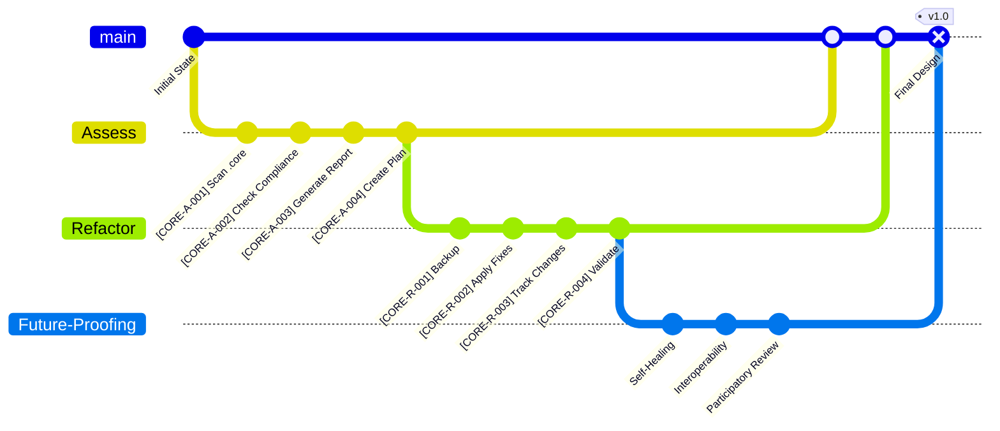

# Design Document: Core Refactoring and Improvement

## Overview

This design document outlines the approach for refactoring and improving the MCP (Model Context Protocol) system. The goal is to enhance the system's architecture, improve code quality, increase test coverage, standardize documentation, and prepare the system for future expansion. The design follows a modular, brain-inspired architecture that maintains the existing conceptual framework while improving implementation consistency and maintainability.

## Architecture

### High-Level Architecture

The refactored MCP system will maintain its brain-inspired architecture while improving consistency and organization. The system will be structured as follows:

```
graph TD
    subgraph "Core Infrastructure"
        A[Core Infrastructure<br/>Handles system initialization]
        B[Setup Core<br/>Initializes system parameters]
        C[Stdio Server<br/>Provides JSON-RPC interface]
        D[Core System<br/>Manages startup and core services]
    end

    subgraph "Memory Management"
        E[Memory Management<br/>Multi-tier vector storage]
        F[Vector Memory<br/>Implements vector storage]
        G[Three Tier Memory Manager<br/>Orchestrates data movement]
        H[Enhanced Vector Memory<br/>Sophisticated vector storage]
        I[Memory Quality Assessment<br/>Evaluates memory health]
    end

    subgraph "Neural & AI Models"
        J[Neural Models<br/>Neural network architectures]
        K[Diffusion Model<br/>Models diffusion processes]
        L[Brain State Integration<br/>Models brain states]
        M[Hormone Neural Integration<br/>Regulates hormones]
        N[Advanced Genetic Evolution<br/>Genetic algorithms]
    end

    subgraph "Workflow & Task Management"
        O[Workflow Management<br/>Orchestrates workflows]
        P[Task Manager<br/>Handles task creation and scheduling]
        Q[Project Manager<br/>Oversees project lifecycle]
    end

    subgraph "P2P Networking"
        R[P2P Networking<br/>Distributed communication]
        S[P2P Network<br/>Implements message passing]
        T[P2P Core Integration<br/>Connects core system with P2P]
        U[P2P Network Bus<br/>Abstracts message bus operations]
    end

    subgraph "Monitoring & Performance"
        V[Monitoring System<br/>Collects system metrics]
        W[Performance Monitor<br/>Tracks performance indicators]
        X[Monitoring Visualization<br/>Provides visual dashboards]
        Y[Performance Optimization Engine<br/>Tunes system parameters]
    end

    subgraph "Web Interface"
        Z[Web Interface<br/>User-friendly GUI for control]
        AA[Frontend<br/>React + Tailwind CSS]
    end

    subgraph "Self-Repair & Self-Improvement"
        AB[Self-Repair<br/>Autonomous diagnostics]
        AC[Self-Improve<br/>Enables recursive optimization]
    end

    subgraph "External Dependencies"
        AD[LLM APIs<br/>For language model interactions]
        AE[Vector Databases<br/>Faiss, SQLite for storage]
        AF[Web Services<br/>Crawling and research data]
        AG[Messaging & Event Bus<br/>For distributed communication]
        AH[Database Management<br/>Persistent storage]
        AI[Monitoring Tools<br/>For health and performance]
        AJ[Plugin System<br/>For extensibility]
    end

    subgraph "Adaptive Lambda Calculus System (ALCS)"
        ALCS_MAIN[Adaptive Lambda Calculus System]
        subgraph "ALCS Processing Core"
            ALCS_QUERY_PARSE[Meta-Lambda Query Parser]
            ALCS_LLM_IF[LLM Interface]
            ALCS_MULTIPLEX[Meta-Lambda Multiplexer]
            ALCS_FILE_ROUTE[File Routing Index]
            ALCS_DEMULTIPLEX[Meta-Lambda Demultiplexer]
            ALCS_RESULT_FORMAT[Result Formatter]
            ALCS_LRS[Lambda Representation System (Internal)]
            ALCS_DYN_REDUCE[Dynamic Reduction Engine]
        end
        subgraph "ALCS Knowledge Domains"
            ALCS_OVERVIEW[Overview Module]
            ALCS_SYNTAX[Syntax & Semantics Module]
            ALCS_CHURCH[Church Encoding Module]
            ALCS_COMBINATORS[Combinators Module]
            ALCS_MATH_OPS[Mathematical Operators Module]
            ALCS_BOOLEANS[Booleans Module]
            ALCS_NUM_COMP[Numeric Comparison Module]
            ALCS_PAIRS_LISTS[Pairs & Lists Module]
            ALCS_LIST_FUNCS[List Functions Module]
            ALCS_OTHER_FUNCS[Other Functions Module]
            ALCS_RECURSION[Recursion Module]
            ALCS_DATA_STRUCTS[Data Structures Module]
            ALCS_TYPED_LC[Typed Lambda Calculus Module]
            ALCS_FORMAL_VER[Formal Verification Sub-Module]
            ALCS_ADV_TOPICS[Advanced Topics Module]
            ALCS_ADV_CONCEPTS[Advanced Concepts Module (Speculative)]
            ALCS_APPS_REL[Applications & Relevance Module]
        end
    end

    User[User (Learner/Researcher)]

    %% Existing connections
    B --> A
    C --> A
    D --> A
    E --> F
    E --> G
    E --> H
    E --> I
    J --> K
    J --> L
    J --> M
    J --> N
    O --> P
    O --> Q
    R --> S
    R --> T
    R --> U
    V --> W
    V --> X
    V --> Y
    Z --> AA
    AB --> AC
    A --> AD
    A --> AE
    A --> AF
    A --> AG
    A --> AH
    A --> AI
    A --> AJ

    A -->|initializes| B
    A -->|provides| C
    A -->|manages| D
    E -->|stores data| F
    E -->|orchestrates| G
    E -->|enhances| H
    E -->|assesses| I
    J -->|interfaces with| A
    O -->|orchestrates| P
    O -->|oversees| Q
    R -->|communicates| S
    R -->|integrates| T
    R -->|abstracts| U
    V -->|collects| W
    V -->|visualizes| X
    V -->|optimizes| Y
    Z -->|interacts with| AA
    AB -->|diagnoses| AC
    A -->|interfaces with| AD
    A -->|interfaces with| AE
    A -->|interfaces with| AF
    A -->|interfaces with| AG
    A -->|interfaces with| AH
    A -->|interfaces with| AI
    A -->|interfaces with| AJ

    %% New connections for ALCS
    User --> Z
    Z --> ALCS_MAIN

    ALCS_MAIN --> ALCS_QUERY_PARSE
    ALCS_MAIN --> ALCS_LRS
    ALCS_MAIN --> ALCS_RESULT_FORMAT

    ALCS_QUERY_PARSE --> ALCS_LLM_IF
    ALCS_QUERY_PARSE --> ALCS_MULTIPLEX

    ALCS_LLM_IF --> AD[LLM APIs]
    ALCS_LLM_IF --> ALCS_RESULT_FORMAT

    ALCS_MULTIPLEX --> ALCS_FILE_ROUTE
    ALCS_FILE_ROUTE --> AE[Vector Databases]
    ALCS_FILE_ROUTE --> AH[Database Management]

    ALCS_MULTIPLEX --> ALCS_DEMULTIPLEX
    ALCS_DEMULTIPLEX --> ALCS_RESULT_FORMAT

    ALCS_LRS --> ALCS_DYN_REDUCE
    ALCS_DYN_REDUCE --> ALCS_SYNTAX

    ALCS_RESULT_FORMAT --> Z

    %% Connections from ALCS Processing Core to Knowledge Domains
    ALCS_MULTIPLEX --> ALCS_OVERVIEW
    ALCS_MULTIPLEX --> ALCS_SYNTAX
    ALCS_MULTIPLEX --> ALCS_CHURCH
    ALCS_MULTIPLEX --> ALCS_COMBINATORS
    ALCS_MULTIPLEX --> ALCS_MATH_OPS
    ALCS_MULTIPLEX --> ALCS_BOOLEANS
    ALCS_MULTIPLEX --> ALCS_NUM_COMP
    ALCS_MULTIPLEX --> ALCS_PAIRS_LISTS
    ALCS_MULTIPLEX --> ALCS_LIST_FUNCS
    ALCS_MULTIPLEX --> ALCS_OTHER_FUNCS
    ALCS_MULTIPLEX --> ALCS_RECURSION
    ALCS_MULTIPLEX --> ALCS_DATA_STRUCTS
    ALCS_MULTIPLEX --> ALCS_TYPED_LC
    ALCS_MULTIPLEX --> ALCS_FORMAL_VER
    ALCS_MULTIPLEX --> ALCS_ADV_TOPICS
    ALCS_MULTIPLEX --> ALCS_ADV_CONCEPTS
    ALCS_MULTIPLEX --> ALCS_APPS_REL

    %% Knowledge Domains using LRS (Implicitly for parsing/displaying terms)
    ALCS_SYNTAX --> ALCS_LRS
    ALCS_CHURCH --> ALCS_LRS
    ALCS_COMBINATORS --> ALCS_LRS
    ALCS_MATH_OPS --> ALCS_LRS
    ALCS_BOOLEANS --> ALCS_LRS
    ALCS_NUM_COMP --> ALCS_LRS
    ALCS_PAIRS_LISTS --> ALCS_LRS
    ALCS_LIST_FUNCS --> ALCS_LRS
    ALCS_OTHER_FUNCS --> ALCS_LRS
    ALCS_RECURSION --> ALCS_LRS
    ALCS_DATA_STRUCTS --> ALCS_LRS
    ALCS_TYPED_LC --> ALCS_LRS
    ALCS_FORMAL_VER --> ALCS_LRS
    ALCS_ADV_TOPICS --> ALCS_LRS
    ALCS_ADV_CONCEPTS --> ALCS_LRS
    ALCS_APPS_REL --> ALCS_LRS

    %% Cross-system interactions of ALCS_MAIN
    ALCS_MAIN --> A[Core Infrastructure]
    ALCS_MAIN --> E[Memory Management]
    ALCS_MAIN --> V[Monitoring System]
    ALCS_MAIN --> O[Workflow Management]
    ALCS_MAIN --> J[Neural Models]
    ALCS_MAIN --> AB[Self-Repair]
    ALCS_MAIN --> AC[Self-Improve]
```

### Modular Design

The system will follow a modular design with clear boundaries between components:

1. **Core System**: Essential functionality required by all components
2. **Lobes**: Specialized modules for specific functions (memory, workflow, etc.)
3. **Tools**: Utilities and scripts for development and deployment
4. **Tests**: Comprehensive test suite for all components
5. **Documentation**: Standardized documentation for all aspects of the system

### Communication Patterns

Components will communicate using standardized interfaces:

1. **Event System**: For asynchronous communication between components
2. **Direct API Calls**: For synchronous interactions
3. **Repository Pattern**: For data access
4. **Strategy Pattern**: For interchangeable implementations

## Components and Interfaces

### Core System Components

1. **Memory Manager**
   - Interface: `IMemoryManager`
   - Responsibilities: Memory storage, retrieval, and management
   - Key Methods: `store()`, `retrieve()`, `query()`, `forget()`

2. **Workflow Engine**
   - Interface: `IWorkflowEngine`
   - Responsibilities: Workflow definition, execution, and monitoring
   - Key Methods: `define_workflow()`, `execute_step()`, `get_status()`

3. **Context Manager**
   - Interface: `IContextManager`
   - Responsibilities: Context generation, management, and export
   - Key Methods: `generate_context()`, `update_context()`, `export_context()`

4. **Database Manager**
   - Interface: `IDatabaseManager`
   - Responsibilities: Database connection, query execution, and transaction management
   - Key Methods: `execute_query()`, `begin_transaction()`, `commit()`, `rollback()`

### Lobe Architecture

Lobes will follow a standardized structure:

1. **Base Lobe Interface**
   - `ILobe`: Common interface for all lobes
   - Key Methods: `initialize()`, `process()`, `shutdown()`

2. **Specialized Lobe Interfaces**
   - `IMemoryLobe`: Memory management functionality
   - `IWorkflowLobe`: Workflow orchestration functionality
   - `IContextLobe`: Context management functionality
   - Additional specialized interfaces as needed

3. **Lobe Communication**
   - Event-based communication between lobes
   - Direct API calls for synchronous operations
   - Clear dependency management

### Tool Integration

Tools will be integrated into the core system using:

1. **Command Pattern**
   - Standardized command interface
   - Registration mechanism for new commands
   - Consistent parameter handling

2. **Plugin System**
   - Plugin discovery and loading
   - Version compatibility checking
   - Standardized plugin interface

## Data Models

### Core Data Models

1. **Memory Item**
   ```python
   class MemoryItem:
       id: str
       content: str
       embedding: List[float]
       metadata: Dict[str, Any]
       created_at: datetime
       updated_at: datetime
       importance: float
       tags: List[str]
   ```

2. **Workflow Definition**
   ```python
   class WorkflowDefinition:
       id: str
       name: str
       description: str
       steps: List[WorkflowStep]
       created_at: datetime
       updated_at: datetime
       status: WorkflowStatus
   ```

3. **Context**
   ```python
   class Context:
       id: str
       content: Dict[str, Any]
       created_at: datetime
       updated_at: datetime
       source: str
       priority: int
   ```

### Database Schema

The system will use SQLAlchemy ORM for database access with the following schema:

1. **Memory Tables**
   - `memory_items`: Core memory storage
   - `memory_vectors`: Vector embeddings for similarity search
   - `memory_tags`: Tags for categorization

2. **Workflow Tables**
   - `workflow_definitions`: Workflow definitions
   - `workflow_steps`: Individual workflow steps
   - `workflow_executions`: Execution history

3. **Context Tables**
   - `contexts`: Context definitions
   - `context_items`: Individual context items
   - `context_history`: Historical context data

## Error Handling

The system will implement a comprehensive error handling strategy:

1. **Exception Hierarchy**
   - `MCPException`: Base exception for all system errors
   - `MemoryException`: Memory-related errors
   - `WorkflowException`: Workflow-related errors
   - `ContextException`: Context-related errors
   - Additional specialized exceptions as needed

2. **Error Logging**
   - Structured logging with context
   - Log levels (DEBUG, INFO, WARNING, ERROR, CRITICAL)
   - Log rotation and archiving

3. **Graceful Degradation**
   - Fallback mechanisms for component failures
   - Circuit breakers for external dependencies
   - Automatic recovery procedures

## Testing Strategy

The testing strategy will include:

1. **Unit Testing**
   - Test individual components in isolation
   - Mock dependencies
   - Focus on edge cases and error handling

2. **Integration Testing**
   - Test component interactions
   - Verify communication patterns
   - Test database interactions

3. **System Testing**
   - End-to-end tests for critical workflows
   - Performance testing
   - Load testing

4. **Test Coverage**
   - Aim for 80%+ code coverage for core components
   - Prioritize critical path testing
   - Regular coverage reporting

5. **Continuous Integration**
   - Automated test execution
   - Pre-commit hooks for basic validation
   - Regular scheduled test runs

## Documentation Standards

Documentation will follow these standards:

1. **Code Documentation**
   - Docstrings for all public methods and classes
   - Type hints for all parameters and return values
   - Examples for complex functionality

2. **Architecture Documentation**
   - Component diagrams
   - Sequence diagrams for complex interactions
   - Data flow diagrams

3. **User Documentation**
   - Installation guides
   - Usage examples
   - Troubleshooting guides

4. **Markdown Formatting**
   - Consistent headers
   - Code blocks with language specification
   - Tables for structured data

## Implementation Plan

The implementation will follow these phases:

1. **Phase 1: Core Refactoring**
   - Refactor core components
   - Implement standardized interfaces
   - Update error handling

2. **Phase 2: Lobe Architecture Standardization**
   - Define lobe interfaces
   - Refactor existing lobes
   - Implement communication patterns

3. **Phase 3: Testing Framework**
   - Implement unit tests
   - Implement integration tests
   - Set up continuous integration

4. **Phase 4: Documentation**
   - Update code documentation
   - Create architecture diagrams
   - Standardize markdown formatting

5. **Phase 5: Tool Integration**
   - Refactor CLI tools
   - Implement plugin system
   - Update deployment scripts

## Migration Strategy

To ensure smooth migration from the existing system:

1. **Backward Compatibility**
   - Maintain existing interfaces
   - Provide adapter layers where needed
   - Deprecate old interfaces gradually

2. **Feature Flags**
   - Use feature flags for new functionality
   - Allow gradual adoption of new components
   - Support A/B testing of new implementations

3. **Data Migration**
   - Provide scripts for database schema updates
   - Ensure data integrity during migration
   - Support rollback procedures

## Performance Considerations

The refactored system will address performance through:

1. **Profiling and Optimization**
   - Identify performance bottlenecks
   - Optimize critical paths
   - Implement caching where appropriate

2. **Concurrency Management**
   - Use async/await for I/O-bound operations
   - Implement thread pools for CPU-bound tasks
   - Manage resource contention

3. **Resource Management**
   - Implement connection pooling
   - Use resource limits to prevent overload
   - Implement backpressure mechanisms

## Security Considerations

Security will be addressed through:

1. **Input Validation**
   - Validate all external inputs
   - Use parameterized queries
   - Implement content security policies

2. **Authentication and Authorization**
   - Role-based access control
   - Principle of least privilege
   - Token-based authentication

3. **Data Protection**
   - Encrypt sensitive data
   - Implement secure deletion
   - Follow data minimization principles

   λ[type:Design, id:DSGN-001.001, status:Draft, owner:CoreTeam, complexity:ℵ[4], refs:[[requirements.md], @MerMaidContextProtocol, @MCP_legend]]
---
## 1. STRATEGY
**Objective:** Assess, refactor, & future-proof the `.core` directory for compliance, automation, & maintainability.
**Architecture:**
- **Assessment Engine:** Scans `.core` for compliance/drift -> Generates report & refactor plan.
- **Refactor Engine:** Applies fixes, updates headers/footers, migrates files, logs changes (Δ). Integrates w/ backup.
- **MCP Integration:** Exposes assessment/refactor actions as MCP server endpoints.
- **Speculative Hooks:** (Future) External agent APIs, distributed sync, community review.

---
## 2. WORKFLOWS

### 2.1. Assessment
1.  `[ ] [CORE-A-001]` **Scan:** Recursively scan `.core`.
2.  `[ ] [CORE-A-002]` **Check:** EARS/MCP compliance, executability, broken links/syntax.
3.  `[ ] [CORE-A-003]` **Report:** Generate machine/human-readable report on issues & actions.
4.  `[ ] [CORE-A-004]` **Plan:** Produce prioritized refactor checklist.

### 2.2. Refactor
1.  `[ ] [CORE-R-001]` **Backup:** Archive all files pre-modification.
2.  `[ ] [CORE-R-002]` **Apply:** Fix headers, docs, scripts, links. Archive irreparable files.
3.  `[ ] [CORE-R-003]` **Track:** Update plan & log all changes (Δ) in backtrack logs.
4.  `[ ] [CORE-R-004]` **Validate:** Re-run assessment to confirm compliance. ᴛ(NonCompliant) -> Compliant.

---
## 3. FUTURES & TESTING
- **Self-Healing:** Watcher/daemon for auto-repair of drift/corruption.
- **Interoperability:** Secure APIs for external agents & distributed sync.
- **Participatory Review:** Publish plans for community feedback.
- **Testing:** Unit, integration, & regression tests for assessment/refactor logic.

---
## 4. VISUALS
*Diagrams illustrate project state & refactor workflow. @MerMaidContextProtocol for standards.*



---
## Obsidian Footer
#group/design #group/core
[[design.md]]
[[DSGN-001.001]]
