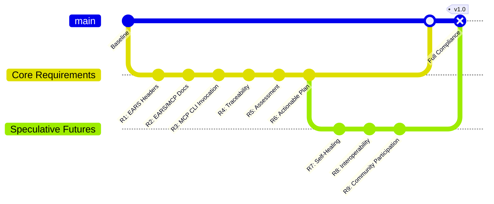

# Requirements Document Ωspecification(core_refactor)

## λoverview(project_scope)

The Core Refactoring and Improvement initiative aims to enhance the MCP (Model Context Protocol) system by restructuring the codebase, improving internal components, and preparing the system for future expansion. This project will Δfocus(implementation_priorities) on refactoring the core components, debugging existing issues, enhancing test coverage, standardizing documentation, and reorganizing tools and scripts for better maintainability and extensibility.

## ℵrequirements(specification_criteria)

### Requirement 1: Ωcore_system_refactoring(architecture_standardization)

**User Story:** As a developer, I want the core system to be refactored with a consistent architecture, so that it's easier to λmaintain(codebase) and λextend(functionality).

#### Acceptance Criteria

1. WHEN examining the codebase THEN the system SHALL follow a consistent modular architecture pattern
2. WHEN adding new components THEN the system SHALL provide clear integration points
3. WHEN refactoring components THEN the system SHALL maintain backward compatibility with existing interfaces
4. WHEN reviewing the code structure THEN the system SHALL organize related functionality into cohesive modules
5. WHEN inspecting the core components THEN the system SHALL demonstrate clear separation of concerns

### Requirement 2: βtesting_framework(comprehensive_validation)

**User Story:** As a quality assurance engineer, I want a comprehensive testing framework, so that I can βensure(system_reliability) and βcatch(regression_issues).

#### Acceptance Criteria

1. WHEN running tests THEN the system SHALL achieve at least 80% code coverage for core components
2. WHEN making changes to the codebase THEN the system SHALL have tests that verify the functionality
3. WHEN running the test suite THEN the system SHALL include unit, integration, and system tests
4. WHEN a test fails THEN the system SHALL provide clear error messages indicating the cause
5. WHEN new features are added THEN the system SHALL require corresponding test cases

### Requirement 3: λdocumentation_standardization(knowledge_transfer)

**User Story:** As a new developer joining the project, I want standardized documentation, so that I can λunderstand(system_architecture) quickly and λcontribute(code_changes) effectively.

#### Acceptance Criteria

1. WHEN reading documentation THEN the system SHALL provide consistent formatting across all documents
2. WHEN examining code files THEN the system SHALL include docstrings that follow a standard format
3. WHEN looking for system architecture THEN the system SHALL provide up-to-date diagrams
4. WHEN searching for component functionality THEN the system SHALL have clear documentation on component purposes and interfaces
5. WHEN reviewing the documentation THEN the system SHALL maintain consistency between code and documentation

### Requirement 4: λtool_integration(organization_optimization)

**User Story:** As a developer, I want all tools and scripts to be properly organized and integrated into the core system, so that I can λfind(utility_components) easily and λuse(development_tools) efficiently.

#### Acceptance Criteria

1. WHEN looking for tools THEN the system SHALL organize them in a logical directory structure
2. WHEN using CLI tools THEN the system SHALL provide a consistent interface
3. WHEN adding new tools THEN the system SHALL have a standard integration process
4. WHEN tools are updated THEN the system SHALL maintain backward compatibility
5. WHEN examining tool documentation THEN the system SHALL provide usage examples

### Requirement 5: Ωlobe_architecture(standardization_framework)

**User Story:** As a system architect, I want the lobe architecture to be standardized and properly organized, so that the brain-inspired design is λmaintain(consistency) and λextend(modularity).

#### Acceptance Criteria

1. WHEN examining the lobe structure THEN the system SHALL organize lobes by function
2. WHEN creating new lobes THEN the system SHALL provide templates and guidelines
3. WHEN lobes interact THEN the system SHALL use standardized communication patterns
4. WHEN reviewing lobe implementations THEN the system SHALL demonstrate consistent error handling
5. WHEN lobes are updated THEN the system SHALL maintain compatibility with the core system

### Requirement 6: Agent Specification Updates

**User Story:** As an AI researcher, I want updated agent specifications, so that agents can leverage the improved core system capabilities.

#### Acceptance Criteria

1. WHEN reviewing agent specifications THEN the system SHALL provide up-to-date documentation
2. WHEN creating new agents THEN the system SHALL have clear guidelines and templates
3. WHEN agents interact with the core system THEN the system SHALL use standardized interfaces
4. WHEN updating agent specifications THEN the system SHALL maintain backward compatibility
5. WHEN examining agent behavior THEN the system SHALL demonstrate consistent performance

### Requirement 7: Performance Optimization

**User Story:** As a user, I want the system to be optimized for performance, so that it responds quickly and efficiently.

#### Acceptance Criteria

1. WHEN running the system THEN the system SHALL demonstrate improved response times compared to the previous version
2. WHEN handling large datasets THEN the system SHALL efficiently manage memory usage
3. WHEN processing multiple requests THEN the system SHALL properly manage concurrency
4. WHEN monitoring system performance THEN the system SHALL provide metrics and logging
5. WHEN the system is under load THEN the system SHALL gracefully handle resource constraints

### Requirement 8: Debugging and Error Handling

**User Story:** As a support engineer, I want improved debugging and error handling, so that I can quickly identify and resolve issues.

#### Acceptance Criteria

1. WHEN an error occurs THEN the system SHALL provide clear error messages
2. WHEN debugging THEN the system SHALL log relevant information at appropriate levels
3. WHEN handling exceptions THEN the system SHALL follow consistent error handling patterns
4. WHEN errors are encountered THEN the system SHALL fail gracefully and maintain data integrity
5. WHEN examining logs THEN the system SHALL provide context for troubleshooting

# Requirements Document

## Introduction

This spec defines the requirements for refactoring the `.core` directory to align with the latest EARS, MerMaidContextProtocol, and automation standards. The goal is to ensure all core scripts, tools, and documentation are modular, maintainable, and fully compatible with CLI, LLM, and Obsidian workflows.

## Requirements

### Requirement 1
**User Story:** As a developer, I want all `.core` scripts and tools to follow a minimal EARS comment header format, so that they remain executable and are easily cross-referenced in automation and documentation.
#### Acceptance Criteria
1. WHEN a new or existing script/tool is added to `.core`, THEN it SHALL include a minimal EARS-format comment header (EARS ID, features, references, backtrack log) as the first comment block.
2. WHEN a script is executed, THEN the EARS header SHALL NOT interfere with its execution or output.

### Requirement 2
**User Story:** As a documentation maintainer, I want all `.core` documentation and protocol files to be EARS and MerMaidContextProtocol compliant, so that they are token-optimized, Obsidian-compatible, and automation-friendly.
#### Acceptance Criteria
1. WHEN a documentation or protocol file is created or updated, THEN it SHALL use 5-letter EARS addresses for actionable items.
2. WHEN a documentation or protocol file is created or updated, THEN it SHALL include an Obsidian footer, cross-links, group/color tags, and a backtrack log.
3. WHEN a documentation or protocol file is created or updated, THEN it SHALL minimize whitespace and optimize for token efficiency.

### Requirement 3
**User Story:** As a project maintainer, I want all core CLI tools to be invocable from the MCP server, so that automation and orchestration workflows can leverage them directly.
#### Acceptance Criteria
1. WHEN a CLI tool is added or updated in `.core/tools`, THEN it SHALL be invocable via the MCP server's `core_cli_tool` endpoint.
2. WHEN a CLI tool is invoked via MCP, THEN its stdout, stderr, and return code SHALL be returned in the response.

### Requirement 4
**User Story:** As a team member, I want all changes to `.core` files to be traceable and reversible, so that the project remains maintainable and auditable.
#### Acceptance Criteria
1. WHEN a file in `.core` is modified, THEN the change SHALL be logged in a backtrack or changelog section in the file or associated log.
2. WHEN a file is refactored, THEN the previous version SHALL be backed up or archived for recovery if needed.

### Requirement 5
**User Story:** As a maintainer, I want to assess the current state of the project and identify broken, outdated, or non-compliant files in `.core`, so that the refactor plan is comprehensive and addresses all issues.
#### Acceptance Criteria
1. WHEN the assessment is run, THEN it SHALL scan all files in `.core` for EARS, MerMaidContextProtocol, and execution compliance.
2. WHEN a file is found to be broken, outdated, or non-compliant, THEN it SHALL be listed in an assessment report with the reason and recommended action.
3. WHEN the assessment is complete, THEN a prioritized refactor plan SHALL be generated based on the findings.

### Requirement 6
**User Story:** As a developer, I want the refactor plan to be actionable and tracked, so that each broken or non-compliant file is addressed systematically.
#### Acceptance Criteria
1. WHEN the refactor plan is created, THEN it SHALL include a checklist of files to fix, update, or migrate, with references to the assessment report and requirements.
2. WHEN a file is refactored, THEN its status SHALL be updated in the plan and the change logged.
3. WHEN all items in the plan are complete, THEN the `.core` directory SHALL be fully compliant and functional.

## Speculative Futures

### Speculative Requirement 7: Plausible Future
**User Story:** As a future project maintainer, I want the `.core` directory to support automated, self-healing refactors and compliance checks, so that the system can adapt to evolving standards and recover from drift or corruption autonomously.
#### Acceptance Criteria
1. WHEN a compliance drift or file corruption is detected, THEN the system SHALL propose or enact automated repairs based on the latest EARS and protocol standards.
2. WHEN new standards or protocols are published, THEN the system SHALL notify maintainers and suggest migration paths.

### Speculative Requirement 8: Possible Future
**User Story:** As an advanced user, I want the `.core` directory to be fully interoperable with external AI agents, distributed systems, and speculative design tools, so that the project can evolve in collaboration with other platforms and communities.
#### Acceptance Criteria
1. WHEN an external agent or tool requests access to `.core` data or tools, THEN the system SHALL provide a secure, documented API for interoperability.
2. WHEN distributed or federated workflows are enabled, THEN `.core` SHALL synchronize changes, compliance, and backtrack logs across all nodes.

### Speculative Requirement 9: Preferred Future
**User Story:** As a community member, I want the `.core` refactor process to be transparent, participatory, and continuously improved, so that the project remains resilient, innovative, and inclusive.
#### Acceptance Criteria
1. WHEN a refactor or assessment is planned, THEN the process SHALL be open for community review, feedback, and contribution.
2. WHEN new speculative requirements or risks are identified, THEN they SHALL be documented and integrated into the ongoing refactor and assessment cycles.
3. WHEN the project achieves a new level of compliance or capability, THEN the achievement SHALL be celebrated and shared with the community.

See [[.core/MerMaidContextProtocol.version-1.0.0.0.mmcp.mmd]] for chart standard and compliance.
