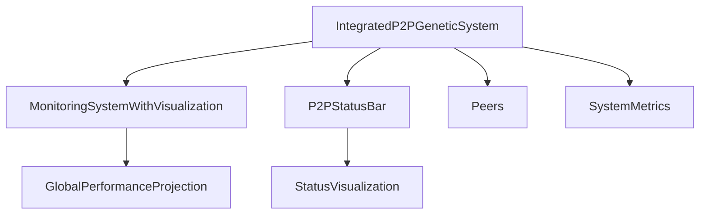

# P2P Benchmarking & Global Performance Projection

## Overview

The MCP system supports distributed benchmarking and global performance projection across all connected P2P peers. This enables real-time monitoring, historical trend analysis, and network status visualization for genetic evolution and optimization.

- **MonitoringSystemWithVisualization**: Collects distributed benchmark data from all connected peers and generates global performance projection reports.
- **P2PStatusBar**: Visualizes the status of the P2P network with a red-green-white bar, showing idle, active, and high-reputation users.
- **IntegratedP2PGeneticSystem**: Provides system metrics, peer status, and performance history for benchmarking and visualization.

## Architecture



## How It Works

- **Benchmark Collection**: `MonitoringSystemWithVisualization.collect_distributed_benchmarks()` gathers performance metrics (fitness, diversity, uptime) from all connected peers in the P2P system.
- **Global Projection**: `generate_global_performance_projection()` aggregates these metrics to produce average fitness, diversity, peer count, and historical trends.
- **Status Visualization**: `P2PStatusBar` renders a real-time red-green-white bar, with tooltips for each segment (idle, active, high-reputation).

## Usage Example

```python
# Assume p2p_system is an instance of IntegratedP2PGeneticSystem
from src.mcp.monitoring_system_visualization_integration import MonitoringSystemWithVisualization, P2PStatusBar

monitor = MonitoringSystemWithVisualization()
benchmarks = monitor.collect_distributed_benchmarks(p2p_system)
projection = monitor.generate_global_performance_projection(p2p_system)

status_bar = P2PStatusBar(p2p_system)
print(status_bar.render())
print(status_bar.get_tooltips())
```

## Cross-Links

- [[IntegratedP2PGeneticSystem]]
- [[MonitoringSystemWithVisualization]]
- [[P2PStatusBar]]
- [[SIMULATION_LAYER]]
- [[ARCHITECTURE.md]]

## Extension Points

- Integrate additional peer metrics (latency, bandwidth, reputation) into benchmarking.
- Extend the status bar for GUI or web-based dashboards.
- Use global performance projection for adaptive network optimization and resource allocation.

---

For more details, see:
- [[ARCHITECTURE.md]]
- [[IntegratedP2PGeneticSystem]]
- [[MonitoringSystemWithVisualization]]
- [[P2PStatusBar]] 