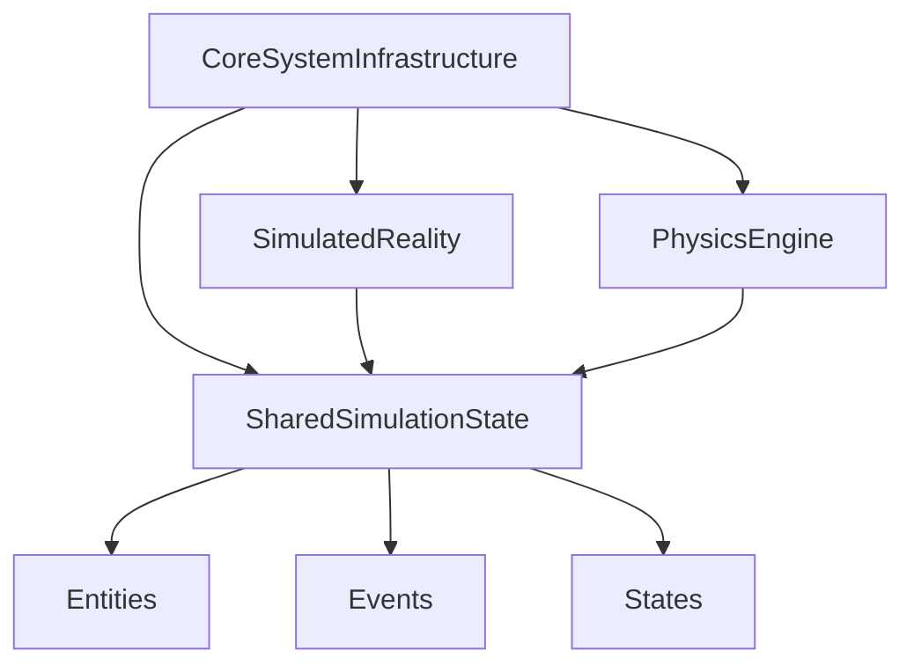

# Simulation Layer Integration

## Overview

The simulation layer in the MCP architecture enables cross-engine coordination and shared world modeling by providing a **thread-safe, global simulation state** accessible to all simulation lobes and engines.

- **SharedSimulationState**: Central registry for entities, events, and states, used by all simulation engines.
- **SimulatedReality**: Maintains a mental model of the world, now using the shared state for all entity/event/state operations.
- **PhysicsEngine**: Handles advanced scientific computation and simulation, also using the shared state for simulation results and events.
- **CoreSystemInfrastructure**: Instantiates and wires up the shared simulation state, passing it to all relevant lobes/engines.

## Architecture



## How It Works

- **Initialization**: `CoreSystemInfrastructure` creates a single `SharedSimulationState` instance and passes it to all simulation lobes/engines.
- **Entity/Event/State Operations**: All simulation engines (e.g., `SimulatedReality`, `PhysicsEngine`) use the shared state for registering, updating, and querying entities, events, and states.
- **Thread Safety**: The shared state uses a reentrant lock to ensure safe concurrent access.
- **Extensibility**: New simulation lobes/engines can be added by passing the shared state to their constructors.

## Usage Example

```python
from src.mcp.simulation.shared_state import SharedSimulationState
from src.mcp.lobes.experimental.simulated_reality import SimulatedReality
from src.mcp.physics_engine import PhysicsEngine

shared_state = SharedSimulationState()
sim_reality = SimulatedReality(shared_state=shared_state)
physics_engine = PhysicsEngine(shared_state=shared_state)

entity_id = sim_reality.create_entity("agent", {"role": "test"})
sim_reality.create_event("move", [entity_id], {"direction": "north"})
physics_engine.simulation_engine._run_simulation({"model": "pendulum", "parameters": {"length": 1.0}})

# Query shared state
events = shared_state.get_all_events()
```

## Cross-Links

- [[SimulatedReality]]
- [[PhysicsEngine]]
- [[CoreSystemInfrastructure]]
- [[EventBus]]

## Extension Points

- Add new simulation lobes/engines by passing `shared_state` to their constructors.
- Use the event bus for event-based synchronization between simulation engines.
- Extend `SharedSimulationState` with additional methods for advanced coordination.

---

For more details, see:
- [[ARCHITECTURE.md]]
- [[SimulatedReality]]
- [[PhysicsEngine]]
- [[CoreSystemInfrastructure]] 