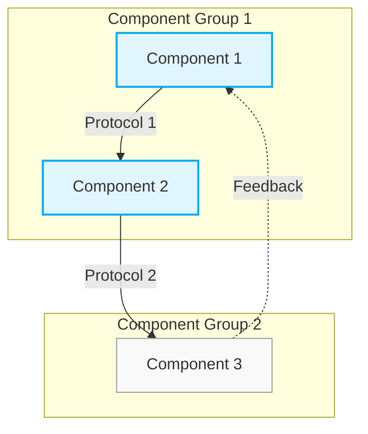

```mmcp
<!-- MMCP-START -->
%% Copyright 2025 Kalxi. All rights reserved. See header for terms. %%
[ ] #".root"# {protocol:"MCP", version:"1.2.1", standard:"PFSUS+EARS+LambdaJSON"}
# {TITLE} v{VERSION}
## {type:Meta, author:"{AUTHOR}", license:"MIT", last_modified:"{DATE}T00:00:00Z", id:"{ID}"}
## {type:Schema, $schema:"https://json-schema.org/draft/2020-12/schema", required:["type","id","version","system"], properties:{type:{type:"string",enum:["System","Architecture","Infrastructure"]},id:{type:"string"},version:{type:"string"},system:{type:"object",required:["name","components"],properties:{name:{type:"string"},components:{type:"array",items:{type:"object",required:["name","type"],properties:{name:{type:"string"},type:{type:"string"},interfaces:{type:"array",items:{type:"object",required:["name","direction"],properties:{name:{type:"string"},direction:{type:"string",enum:["input","output","bidirectional"]}}}}}}},connections:{type:"array",items:{type:"object",required:["from","to"],properties:{from:{type:"string"},to:{type:"string"}}}}}}}}
## {type:Changelog, entries:[{"{DATE}":"Initial version."}]}

## {type:{SYSTEM_TYPE}, id:"{ID}", desc:"{DESCRIPTION}"}

## 1. Overview

{OVERVIEW}

## 2. System Architecture



## 3. Component Definitions

### Component 1
- **Type**: {COMPONENT_1_TYPE}
- **Description**: {COMPONENT_1_DESCRIPTION}
- **Interfaces**:
  - **Interface 1.1**: Output, Protocol 1
  - **Interface 1.2**: Input, Feedback Protocol

### Component 2
- **Type**: {COMPONENT_2_TYPE}
- **Description**: {COMPONENT_2_DESCRIPTION}
- **Interfaces**:
  - **Interface 2.1**: Input, Protocol 1
  - **Interface 2.2**: Output, Protocol 2
- **Dependencies**: Component 1

### Component 3
- **Type**: {COMPONENT_3_TYPE}
- **Description**: {COMPONENT_3_DESCRIPTION}
- **Interfaces**:
  - **Interface 3.1**: Input, Protocol 2
  - **Interface 3.2**: Output, Feedback Protocol
- **Dependencies**: Component 2

## 4. Connection Definitions

### Connection 1: Component 1 to Component 2
- **Protocol**: Protocol 1
- **Data Format**: {CONNECTION_1_DATA_FORMAT}
- **Description**: {CONNECTION_1_DESCRIPTION}

### Connection 2: Component 2 to Component 3
- **Protocol**: Protocol 2
- **Data Format**: {CONNECTION_2_DATA_FORMAT}
- **Description**: {CONNECTION_2_DESCRIPTION}

### Connection 3: Component 3 to Component 1
- **Protocol**: Feedback Protocol
- **Data Format**: {CONNECTION_3_DATA_FORMAT}
- **Description**: {CONNECTION_3_DESCRIPTION}

## 5. System Metrics

| Metric | Component | Unit | Description |
|--------|-----------|------|-------------|
| Metric 1 | Component 1 | {METRIC_1_UNIT} | {METRIC_1_DESCRIPTION} |
| Metric 2 | Component 2 | {METRIC_2_UNIT} | {METRIC_2_DESCRIPTION} |
| Metric 3 | Component 3 | {METRIC_3_UNIT} | {METRIC_3_DESCRIPTION} |

## {type:SelfReference, file:"{FILENAME}", version:"{VERSION}", checksum:"sha256:{CHECKSUM}", canonical_address:"{ADDRESS}", self_repair:{desc:"If checksum fails, fetch canonical version from CoreManifest.", source:"CoreManifest"}, project_agnostic:true}

@{visual-meta-start}
author = {{AUTHOR}},
title = {{TITLE}},
version = {{VERSION}},
structure = { overview, system_architecture, component_definitions, connection_definitions, system_metrics },
@{visual-meta-end}
%% MMCP-FOOTER: version={VERSION}; timestamp={DATE}T00:00:00Z; checksum=sha256:{CHECKSUM}; author={AUTHOR}; license=MIT
<!-- MMCP-END -->
```