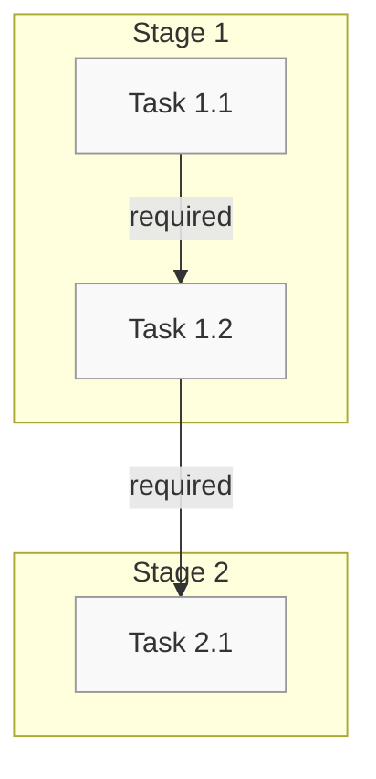

```mmcp
<!-- MMCP-START -->
%% Copyright 2025 Kalxi. All rights reserved. See header for terms. %%
[ ] #".root"# {protocol:"MCP", version:"1.2.1", standard:"PFSUS+EARS+LambdaJSON"}
# {TITLE} v{VERSION}
## {type:Meta, author:"{AUTHOR}", license:"MIT", last_modified:"{DATE}T00:00:00Z", id:"{ID}"}
## {type:Schema, $schema:"https://json-schema.org/draft/2020-12/schema", required:["type","id","version","workflow"], properties:{type:{type:"string",enum:["Workflow","Process","Pipeline"]},id:{type:"string"},version:{type:"string"},workflow:{type:"object",required:["name","stages"],properties:{name:{type:"string"},stages:{type:"array",items:{type:"object",required:["name","tasks"],properties:{name:{type:"string"},tasks:{type:"array",items:{type:"object",required:["name","status"],properties:{name:{type:"string"},status:{type:"string",enum:["not_started","in_progress","completed","blocked","skipped"]}}}}}}},dependencies:{type:"array",items:{type:"object",required:["from","to"],properties:{from:{type:"string"},to:{type:"string"},type:{type:"string",enum:["required","optional","blocking"]}}}}}}}}
## {type:Changelog, entries:[{"{DATE}":"Initial version."}]}

## {type:{WORKFLOW_TYPE}, id:"{ID}", desc:"{DESCRIPTION}"}

## 1. Overview

{OVERVIEW}

## 2. Workflow Definition

```json
{
  "name": "{WORKFLOW_NAME}",
  "description": "{WORKFLOW_DESCRIPTION}",
  "stages": [
    {
      "name": "Stage 1",
      "description": "First stage of the workflow",
      "tasks": [
        {
          "name": "Task 1.1",
          "description": "First task in Stage 1",
          "status": "not_started"
        },
        {
          "name": "Task 1.2",
          "description": "Second task in Stage 1",
          "status": "not_started",
          "dependencies": ["Task 1.1"]
        }
      ]
    },
    {
      "name": "Stage 2",
      "description": "Second stage of the workflow",
      "tasks": [
        {
          "name": "Task 2.1",
          "description": "First task in Stage 2",
          "status": "not_started",
          "dependencies": ["Task 1.2"]
        }
      ]
    }
  ],
  "dependencies": [
    {
      "from": "Task 1.1",
      "to": "Task 1.2",
      "type": "required"
    },
    {
      "from": "Task 1.2",
      "to": "Task 2.1",
      "type": "required"
    }
  ]
}
```

## 3. Workflow Visualization



## 4. Task Details

### Stage 1

#### Task 1.1: First task in Stage 1
- **Status**: Not Started
- **Description**: {TASK_1_1_DESCRIPTION}
- **Dependencies**: None

#### Task 1.2: Second task in Stage 1
- **Status**: Not Started
- **Description**: {TASK_1_2_DESCRIPTION}
- **Dependencies**: Task 1.1

### Stage 2

#### Task 2.1: First task in Stage 2
- **Status**: Not Started
- **Description**: {TASK_2_1_DESCRIPTION}
- **Dependencies**: Task 1.2

## {type:SelfReference, file:"{FILENAME}", version:"{VERSION}", checksum:"sha256:{CHECKSUM}", canonical_address:"{ADDRESS}", self_repair:{desc:"If checksum fails, fetch canonical version from CoreManifest.", source:"CoreManifest"}, project_agnostic:true}

@{visual-meta-start}
author = {{AUTHOR}},
title = {{TITLE}},
version = {{VERSION}},
structure = { overview, workflow_definition, workflow_visualization, task_details },
@{visual-meta-end}
%% MMCP-FOOTER: version={VERSION}; timestamp={DATE}T00:00:00Z; checksum=sha256:{CHECKSUM}; author={AUTHOR}; license=MIT
<!-- MMCP-END -->
```