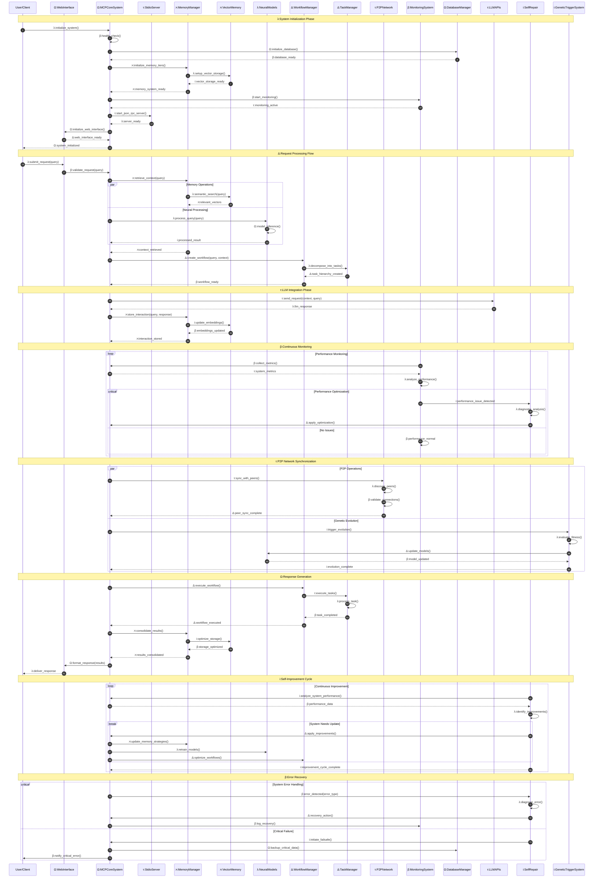

# MCP Core System


## λ:core_system_overview(brain_inspired_modular_framework)

The MCP (Model Context Protocol) Core System is a brain-inspired, modular AI system designed to enhance AI agent workflows and context management. It provides a sophisticated framework for managing AI interactions, memory, and task execution with PFSUS-compliant lambda operator integration.

## Core Features
### λ:feature_matrix(brain_inspired_capabilities)

- **λ:architecture(brain_inspired_lobes)**: Modular design with specialized "lobes" for different functions
- **ℵ:memory_management(multi_tier_vector_search)**: Multi-tier memory system with vector storage and semantic search
- **Δ:workflow_orchestration(structured_task_dependencies)**: Structured workflow management with phases, tasks, and dependencies
- **τ:context_management(dynamic_llm_export)**: Dynamic context generation and export for LLM consumption
- **i:hormone_system(adaptive_behavior_regulation)**: Brain-inspired hormone regulation for adaptive behavior
- **β:performance_monitoring(comprehensive_optimization)**: Comprehensive monitoring and optimization
- **Ω:self_healing(automatic_error_recovery)**: Automatic error recovery and system maintenance

## Getting Started
### λ:installation_sequence(setup_configuration_validation)

#### Prerequisites
- **τ:runtime_environment(python_3_9_plus)**: Python 3.9+
- **ℵ:dependency_management(requirements_txt)**: Required packages (see `requirements.txt`)

#### Installation
1. **λ:step_1(repository_clone)**: Clone the repository
2. **Ω:step_2(setup_execution)**: Run the setup script:

```bash
# β:core_setup(automated_initialization)
python core/setup_core.py
```

This will:
- **Δ:directory_creation(necessary_structure)**: Create necessary directories
- **i:configuration_setup(default_settings)**: Set up default configuration
- **ℵ:dependency_installation(package_management)**: Install dependencies
- **τ:health_validation(system_check)**: Run a system health check

### Basic Usage
#### λ:usage_example(async_system_interaction)

```python
# τ:imports(core_system_modules)
import asyncio
from core.src.mcp.core_system import initialize_core_system, shutdown_core_system

# Ω:main_execution(async_workflow)
async def main():
    # λ:step_1(system_initialization)
    system = await initialize_core_system()
    
    # β:step_2(request_execution)
    response = await system.execute_request({
        'method': 'memory/add',  # ℵ:memory_operation(add_greeting)
        'params': {
            'text': 'Hello, MCP!',
            'memory_type': 'greeting',
            'priority': 0.8  # Δ:priority_weighting(high_importance)
        }
    })
    
    # i:step_3(response_processing)
    print(f"Response: {response}")
    
    # Ω:step_4(system_shutdown)
    await shutdown_core_system()

# τ:entry_point(async_execution)
if __name__ == "__main__":
    asyncio.run(main())
```

## System Architecture
### λ:architecture_overview(modular_brain_inspired_design)

#### Core Components
##### τ:component_hierarchy(orchestrator_lobes_managers)

- **Ω:core_system(central_orchestrator)**: Central orchestrator for all components
- **λ:lobes(specialized_brain_modules)**: Specialized brain-inspired modules
  - **ℵ:memory_lobe(memory_operations)**: Manages memory operations
  - **Δ:workflow_lobe(execution_handling)**: Handles workflow execution
  - **τ:context_lobe(generation_management)**: Manages context generation
  - **β:task_lobe(task_management)**: Handles task management
- **i:managers(core_functionality_providers)**: Core functionality providers
  - **ℵ:memory_manager(storage_retrieval)**: Memory storage and retrieval
  - **Δ:workflow_manager(orchestration)**: Workflow orchestration
  - **τ:context_manager(generation_optimization)**: Context generation and optimization
  - **β:task_manager(tracking_execution)**: Task tracking and execution
  - **Ω:database_manager(optimized_operations)**: Optimized database operations
  - **λ:performance_monitor(system_monitoring_optimization)**: System monitoring and optimization

### Brain-Inspired Features
#### λ:brain_features(cognitive_architecture_patterns)

- **ℵ:multi_tier_memory(working_short_long_term)**: Working, short-term, and long-term memory
- **Δ:memory_consolidation(automatic_optimization)**: Automatic memory optimization
- **i:hormone_system(adaptive_behavior_regulation)**: Adaptive regulation of system behavior
- **τ:attention_management(high_priority_focus)**: Focus on high-priority tasks
- **β:learning(continuous_feedback_improvement)**: Continuous improvement through feedback

## API Reference

### Memory Operations

- `memory/add`: Add a new memory
- `memory/search`: Search memories
- `memory/get`: Get a specific memory
- `memory/tag`: Add a tag to a memory
- `memory/untag`: Remove a tag from a memory
- `memory/search_by_tag`: Search memories by tag
- `memory/stats`: Get memory statistics

### Workflow Operations

- `workflow/create`: Create a new workflow
- `workflow/add_step`: Add a step to a workflow
- `workflow/start`: Start a workflow
- `workflow/pause`: Pause a workflow
- `workflow/resume`: Resume a paused workflow
- `workflow/status`: Get workflow status

### Task Operations

- `task/create`: Create a new task
- `task/list`: List tasks
- `task/update`: Update task progress
- `task/complete`: Mark a task as completed

### Context Operations

- `context/export`: Export context for LLM consumption
- `context/save_pack`: Save a context pack
- `context/load_pack`: Load a saved context pack
- `context/stats`: Get context statistics

### System Operations

- `system/status`: Get system status
- `system/health`: Get detailed health information
- `system/optimize`: Trigger system optimization
- `system/backup`: Trigger system backup
- `system/cleanup`: Trigger system cleanup

### Hormone Operations

- `hormone/levels`: Get hormone levels
- `hormone/adjust`: Adjust a hormone level
- `hormone/reset`: Reset hormone levels to defaults

## Development

### Running Tests

```bash
pytest core/tests/
```

### System Health Check

```bash
python core/system_health_check.py
```

## License
### Ω:legal_framework(mit_license)

This project is licensed under the MIT License - see the LICENSE file for details.

## File Naming Standards
### λ:pfsus_compliance(order_agnostic_format_wrapping)

Following PFSUS.MMCP-FormatWrapping.Standard.v1.4.0, core files use order-agnostic nested format notation:
- **Core System**: `core_system.core.v<version>.py`
- **Lobes**: `<lobe_name>.lobe.v<version>.py` 
- **Managers**: `<manager_name>.manager.v<version>.py`
- **Tests**: `test_<component>.pytest.v<version>.py`
- **Specifications**: `<spec_name>.specification.v<version>.mmcp.mmd`
- **Lambda Sequences**: `*.lambda.alef.md.sequence.mmd.py` (functional → set-theoretic → markdown → sequence → mermaid → python)

## τ:self_reference(core_readme_metadata)
{type:Documentation, file:"core/README.md", version:"1.0.0", checksum:"sha256:core_readme_checksum", canonical_address:"core-readme", pfsus_compliant:true, lambda_operators:true, file_format:"readme.core.v1.0.0.md"}

@{visual-meta-start}
author = {MCP Core Team},
title = {MCP Core System},
version = {1.0.0},
file_format = {readme.core.v1.0.0.md},
structure = { overview, features, installation, usage, architecture, api_reference, development, license, file_naming_standards },
file_naming_standards = {pfsus_compliant, order_agnostic, lambda_operators},
@{visual-meta-end}

%% MMCP-FOOTER: version=1.0.0; timestamp=2025-07-22T00:00:00Z; author=MCP_Core_Team; pfsus_compliant=true; lambda_operators=integrated; file_format=readme.core.v1.0.0.md