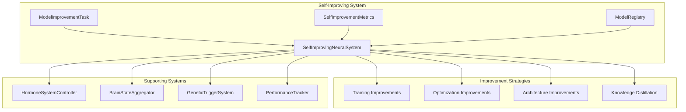

# Self-Improving Neural System

## Epic
**As a** developer or system administrator
**I want** a comprehensive understanding of the self-improving neural system
**So that** I can effectively configure, monitor, and optimize the recursive self-improvement capabilities

## Overview

The Self-Improving Neural System is the core engine that enables recursive self-improvement of neural networks within the MCP. It creates a feedback loop where improved neural networks can then be used to improve other neural networks, leading to continuous enhancement and evolution of the entire system.

## Architecture

### Core Components



### Class Structure

```python
class SelfImprovingNeuralSystem:
    def __init__(self, 
                 hormone_integration: Optional[HormoneNeuralIntegration] = None,
                 genetic_system: Optional[IntegratedGeneticTriggerSystem] = None,
                 hormone_system: Optional[HormoneSystemController] = None,
                 brain_state: Optional[BrainStateAggregator] = None):
        
        # Core system components
        self.hormone_integration = hormone_integration
        self.genetic_system = genetic_system
        self.hormone_system = hormone_system
        self.brain_state = brain_state
        
        # Improvement tracking
        self.improvement_history: List[SelfImprovementMetrics] = []
        self.improvement_tasks: deque = deque(maxlen=1000)
        self.active_tasks: Dict[str, ModelImprovementTask] = {}
        self.completed_tasks: Dict[str, ModelImprovementTask] = {}
        
        # Model registry
        self.model_registry: Dict[str, Dict[str, Any]] = {}
        self.model_versions: Dict[str, List[str]] = defaultdict(list)
        self.model_performance: Dict[str, List[float]] = defaultdict(list)
        
        # Self-improvement state
        self.iteration = 0
        self.total_improvements = 0
        self.best_improvement = 0.0
        self.improvement_active = False
```

## Key Methods

### Lifecycle Management

#### `start_self_improvement_loop()`
Starts the continuous self-improvement process.

```python
async def start_self_improvement_loop(self):
    """Start the continuous self-improvement loop"""
    if self.improvement_active:
        self.logger.warning("Self-improvement loop already active")
        return
    
    self.improvement_active = True
    self.improvement_thread = threading.Thread(
        target=self._improvement_loop, daemon=True
    )
    self.improvement_thread.start()
    
    self.logger.info("Self-improvement loop started")
```

#### `stop_self_improvement_loop()`
Stops the self-improvement process.

```python
async def stop_self_improvement_loop(self):
    """Stop the self-improvement loop"""
    self.improvement_active = False
    if self.improvement_thread:
        self.improvement_thread.join(timeout=10.0)
    
    self.logger.info("Self-improvement loop stopped")
```

#### `force_improvement_cycle()`
Forces an immediate improvement cycle.

```python
async def force_improvement_cycle(self):
    """Force an immediate improvement cycle"""
    await self._run_improvement_cycle()
```

### Task Management

#### `_generate_improvement_tasks()`
Generates improvement tasks based on current system state.

```python
async def _generate_improvement_tasks(self) -> List[ModelImprovementTask]:
    """Generate improvement tasks based on current system state"""
    tasks = []
    
    # Analyze current model performance
    model_performance = await self._analyze_model_performance()
    
    for model_id, performance in model_performance.items():
        if performance['needs_improvement']:
            # Determine improvement type based on performance gaps
            improvement_type = self._determine_improvement_type(performance)
            
            # Calculate priority based on hormone levels and genetic triggers
            priority = await self._calculate_task_priority(model_id, performance)
            
            task = ModelImprovementTask(
                model_id=model_id,
                model_type=performance['model_type'],
                improvement_type=improvement_type,
                priority=priority,
                target_metrics=performance['target_metrics'],
                constraints=performance['constraints']
            )
            
            tasks.append(task)
    
    # Sort by priority
    tasks.sort(key=lambda x: x.priority, reverse=True)
    
    # Limit to max concurrent tasks
    return tasks[:self.config['max_concurrent_tasks']]
```

#### `_execute_improvement_task()`
Executes a specific improvement task.

```python
async def _execute_improvement_task(self, task: ModelImprovementTask) -> Optional[Dict[str, Any]]:
    """Execute a specific improvement task"""
    self.logger.info(f"Executing improvement task: {task.model_id} ({task.improvement_type})")
    
    task.status = "running"
    start_time = time.time()
    
    try:
        if task.improvement_type == 'training':
            result = await self._improve_model_training(task)
        elif task.improvement_type == 'optimization':
            result = await self._improve_model_optimization(task)
        elif task.improvement_type == 'architecture':
            result = await self._improve_model_architecture(task)
        elif task.improvement_type == 'distillation':
            result = await self._improve_model_distillation(task)
        else:
            self.logger.warning(f"Unknown improvement type: {task.improvement_type}")
            return None
        
        task.status = "completed"
        execution_time = time.time() - start_time
        
        # Record improvement
        self._record_model_improvement(task, result, execution_time)
        
        return {
            'task_id': task.model_id,
            'improvement_type': task.improvement_type,
            'performance_gain': result.get('performance_gain', 0.0),
            'execution_time': execution_time,
            'new_metrics': result.get('new_metrics', {})
        }
        
    except Exception as e:
        self.logger.error(f"Error executing task {task.model_id}: {e}")
        task.status = "failed"
        return None
```

### Improvement Strategies

#### Training Improvements
```python
async def _improve_model_training(self, task: ModelImprovementTask) -> Dict[str, Any]:
    """Improve model through better training strategies"""
    model_id = task.model_id
    
    # Get current model
    model = await self._get_model(model_id)
    if not model:
        raise ValueError(f"Model {model_id} not found")
    
    # Generate training data using the system itself
    training_data = await self._generate_training_data(model_id)
    
    # Use improved training strategies
    improved_model = await self._train_with_improved_strategies(model, training_data, task)
    
    # Evaluate improvement
    old_performance = await self._evaluate_model(model, training_data)
    new_performance = await self._evaluate_model(improved_model, training_data)
    
    performance_gain = new_performance['accuracy'] - old_performance['accuracy']
    
    # Save improved model
    await self._save_improved_model(model_id, improved_model)
    
    return {
        'performance_gain': performance_gain,
        'new_metrics': new_performance,
        'training_samples': len(training_data)
    }
```

#### Optimization Improvements
```python
async def _improve_model_optimization(self, task: ModelImprovementTask) -> Dict[str, Any]:
    """Improve model through optimization techniques"""
    model_id = task.model_id
    
    # Get current model
    model = await self._get_model(model_id)
    if not model:
        raise ValueError(f"Model {model_id} not found")
    
    # Apply optimization techniques
    optimized_model = await self._apply_optimization_techniques(model, task)
    
    # Evaluate improvement
    test_data = await self._generate_test_data(model_id)
    old_performance = await self._evaluate_model(model, test_data)
    new_performance = await self._evaluate_model(optimized_model, test_data)
    
    performance_gain = new_performance['latency_improvement']
    
    # Save optimized model
    await self._save_improved_model(model_id, optimized_model)
    
    return {
        'performance_gain': performance_gain,
        'new_metrics': new_performance,
        'optimization_techniques': ['quantization', 'pruning', 'knowledge_distillation']
    }
```

### Data Generation

#### Training Data Generation
```python
async def _generate_hormone_training_data(self, hormone_name: str) -> List[Tuple]:
    """Generate training data for hormone neural models"""
    training_data = []
    
    # Use the system's own hormone calculations to generate training data
    for _ in range(1000):  # Generate 1000 training samples
        # Create random context
        context = {
            'stress_level': np.random.random(),
            'error_frequency': np.random.random(),
            'resource_constraints': np.random.random(),
            'task_complexity': np.random.random(),
            'user_interaction_level': np.random.random(),
            'system_load': np.random.random(),
            'memory_usage': np.random.random(),
            'network_activity': np.random.random(),
            'learning_rate': np.random.random(),
            'confidence_level': np.random.random()
        }
        
        # Get algorithmic result as ground truth
        if self.hormone_integration:
            algorithmic_result = await self.hormone_integration.calculate_hormone(
                hormone_name, context, implementation='algorithmic'
            )
            
            # Convert context to features
            features = self._extract_features_from_context(context)
            target = algorithmic_result.calculated_value
            
            training_data.append((features, target))
    
    return training_data
```

### Performance Monitoring

#### Metrics Tracking
```python
async def _update_improvement_metrics(self, completed_tasks: List[Dict[str, Any]]):
    """Update improvement metrics"""
    if not completed_tasks:
        return
    
    total_improvement = sum(task.get('performance_gain', 0) for task in completed_tasks)
    best_gain = max(task.get('performance_gain', 0) for task in completed_tasks)
    avg_training_time = np.mean([task.get('execution_time', 0) for task in completed_tasks])
    
    # Get hormone levels
    hormone_levels = {}
    if self.hormone_system:
        hormone_levels = self.hormone_system.get_hormone_levels()
    
    # Get genetic activations
    genetic_activations = 0
    if self.genetic_system:
        genetic_activations = len(self.genetic_system.active_triggers)
    
    # Get memory usage
    memory_usage = 0.0
    if self.brain_state:
        brain_state = self.brain_state.get_system_state()
        memory_usage = brain_state.get('memory_usage', 0.0)
    
    metrics = SelfImprovementMetrics(
        iteration=self.iteration,
        models_improved=len(completed_tasks),
        total_improvement=total_improvement,
        best_performance_gain=best_gain,
        average_training_time=avg_training_time,
        hormone_levels=hormone_levels,
        genetic_activations=genetic_activations,
        memory_usage=memory_usage
    )
    
    self.improvement_history.append(metrics)
    
    self.logger.info(f"Improvement metrics: {len(completed_tasks)} models improved, "
                    f"total gain: {total_improvement:.4f}, best gain: {best_gain:.4f}")
```

## Configuration

### System Configuration
```python
config = {
    'max_concurrent_tasks': 3,
    'improvement_interval': 300.0,  # 5 minutes
    'performance_threshold': 0.1,  # 10% improvement required
    'max_iterations': 1000,
    'model_save_path': 'data/improved_models',
    'backup_models': True,
    'hormone_driven_optimization': True,
    'genetic_architecture_search': True,
    'cross_model_distillation': True
}
```

### Model Registry
The system maintains a comprehensive registry of all models:

```python
model_registry = {
    'model_id': {
        'version': 'v1.2.3',
        'improvement_timestamp': '2024-01-15T10:30:00',
        'model_size': 1000000,
        'performance_metrics': {
            'accuracy': 0.85,
            'latency': 45.0,
            'resource_usage': 0.3
        }
    }
}
```

## Integration Points

### Hormone System Integration
- **Dopamine**: Influences priority for reward-seeking improvements
- **Cortisol**: Increases priority for stress-related optimizations
- **Growth Hormone**: Affects learning rate adaptation
- **Serotonin**: Influences system stability decisions

### Genetic System Integration
- **Environmental Triggers**: Genetic triggers influence optimization targeting
- **Adaptation Patterns**: System learns optimal configurations for different environments
- **Evolutionary Development**: Continuous improvement through genetic-like processes

### Brain State Integration
- **System Monitoring**: Real-time monitoring of system state
- **Resource Management**: Intelligent resource allocation based on brain state
- **Performance Tracking**: Comprehensive performance metrics collection

## Usage Examples

### Basic Usage
```python
# Create self-improving system
system = SelfImprovingNeuralSystem(
    hormone_integration=hormone_integration,
    genetic_system=genetic_system,
    hormone_system=hormone_system,
    brain_state=brain_state
)

# Start self-improvement
await system.start_self_improvement_loop()

# Force improvement cycle
await system.force_improvement_cycle()

# Get status
status = await system.get_improvement_status()
```

### Advanced Usage
```python
# Add custom improvement task
task = ModelImprovementTask(
    model_id='custom_model',
    model_type='pattern',
    improvement_type='architecture',
    priority=2.0,
    target_metrics={'accuracy': 0.9, 'latency': 30.0},
    constraints={'max_model_size': 500000}
)

await system.add_improvement_task(task)

# Get improvement history
history = await system.get_improvement_history(limit=50)

# Get model performance
performance = await system.get_model_performance('hormone_dopamine')
```

## Monitoring and Debugging

### Status Monitoring
```python
# Get comprehensive status
status = await system.get_improvement_status()

print(f"Iteration: {status['iteration']}")
print(f"Total Improvements: {status['total_improvements']}")
print(f"Active Tasks: {status['active_tasks']}")
print(f"Models Registered: {status['models_registered']}")
```

### Performance Analysis
```python
# Get improvement history
history = await system.get_improvement_history(100)

for metrics in history:
    print(f"Cycle {metrics.iteration}: "
          f"{metrics.models_improved} models improved, "
          f"total gain: {metrics.total_improvement:.4f}")
```

### Health Monitoring
```python
# Check system health
if system.improvement_active:
    print("Self-improvement is active")
else:
    print("Self-improvement is inactive")

# Check recent improvements
recent_improvements = system.improvement_history[-10:]
avg_improvement = np.mean([m.total_improvement for m in recent_improvements])
print(f"Average improvement per cycle: {avg_improvement:.4f}")
```

## Troubleshooting

### Common Issues

#### 1. No Improvements Generated
**Symptoms**: System runs but no improvement tasks are created
**Causes**: 
- All models already meet performance thresholds
- Configuration issues with performance thresholds
- Missing model performance data

**Solutions**:
```python
# Check performance thresholds
print(f"Performance threshold: {system.config['performance_threshold']}")

# Force lower threshold for testing
system.config['performance_threshold'] = 0.01

# Check model performance
for model_id, performance in system.model_performance.items():
    print(f"{model_id}: {performance}")
```

#### 2. Improvement Tasks Failing
**Symptoms**: Tasks are created but fail during execution
**Causes**:
- Missing dependencies (PyTorch, NumPy)
- Insufficient resources
- Model loading errors

**Solutions**:
```python
# Check dependencies
try:
    import torch
    print("PyTorch available")
except ImportError:
    print("PyTorch not available")

# Check available models
models = await system.get_available_models()
print(f"Available models: {models}")

# Check system resources
import psutil
print(f"Memory usage: {psutil.virtual_memory().percent}%")
print(f"CPU usage: {psutil.cpu_percent()}%")
```

#### 3. Slow Improvement Cycles
**Symptoms**: Improvement cycles take too long
**Causes**:
- Large model sizes
- Complex training data generation
- Resource constraints

**Solutions**:
```python
# Reduce concurrent tasks
system.config['max_concurrent_tasks'] = 1

# Reduce training data size
# Modify _generate_training_data to generate fewer samples

# Increase improvement interval
system.config['improvement_interval'] = 600.0  # 10 minutes
```

## Performance Optimization

### Configuration Tuning
```python
# Optimize for speed
system.config.update({
    'max_concurrent_tasks': 1,
    'improvement_interval': 600.0,
    'performance_threshold': 0.2,
    'max_iterations': 100
})

# Optimize for quality
system.config.update({
    'max_concurrent_tasks': 5,
    'improvement_interval': 300.0,
    'performance_threshold': 0.05,
    'max_iterations': 2000
})
```

### Resource Management
```python
# Monitor resource usage
import psutil
import threading

def monitor_resources():
    while True:
        memory = psutil.virtual_memory()
        cpu = psutil.cpu_percent()
        
        if memory.percent > 80:
            # Reduce concurrent tasks
            system.config['max_concurrent_tasks'] = max(1, system.config['max_concurrent_tasks'] - 1)
        
        time.sleep(60)

monitor_thread = threading.Thread(target=monitor_resources, daemon=True)
monitor_thread.start()
```

## Related Documentation

### Core Systems
- [[../core-systems/Memory-System|Memory System]] - Three-tier memory architecture
- [[../hormone-system/README|Hormone System]] - Cross-lobe communication
- [[../genetic-system/README|Genetic System]] - Environmental adaptation

### Neural Network Components
- [[Self-Improvement-Integration|Self-Improvement Integration]] - MCP integration layer
- [[Hormone-Neural-Integration|Hormone Neural Integration]] - Hormone calculation models
- [[Neural-Performance-Tracker|Neural Performance Tracker]] - Performance monitoring

### Development
- [[../development/README|Developer Guide]] - Development and integration
- [[../testing/README|Testing Guide]] - Testing strategies
- [[../api/README|API Reference]] - Technical API reference

## Conclusion

The Self-Improving Neural System represents a significant advancement in autonomous AI systems. By enabling neural networks to improve themselves and each other, it creates a foundation for continuous evolution and optimization. The integration with brain-inspired architectures, hormone systems, and genetic algorithms provides a robust framework for intelligent self-improvement.

This system demonstrates the potential for AI systems to become truly self-improving, leading to more capable, efficient, and adaptive artificial intelligence systems.

## Related Documentation
- [[../README|Project Overview]]
- [[../architecture/README|System Architecture]]
- [[../development/README|Development Guide]] 