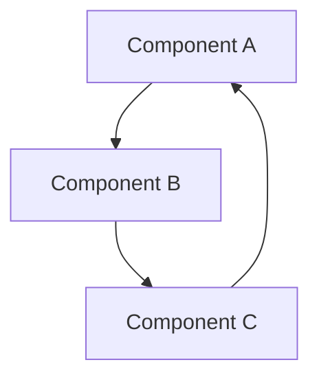

# Simulation Layer Architecture

## Epic
**As a** system architect
**I want** to understand the architecture of simulation layer
**So that** I can design effective solutions

## User Stories

### Story 1: Architecture Understanding
**As a** architect
**I want** to understand the simulation layer architecture
**So that** I can make informed design decisions

**Acceptance Criteria:**
- [ ] Given I need to understand simulation layer, When I read the architecture docs, Then I understand the design
- [ ] Given I understand the architecture, When I design solutions, Then they align with the system

### Story 2: Integration Design
**As a** architect
**I want** to design integrations with simulation layer
**So that** I can create effective system designs

**Acceptance Criteria:**
- [ ] Given I need to integrate with simulation layer, When I understand the architecture, Then I can design effective integrations
- [ ] Given I design integrations, When I implement them, Then they work correctly

## Architecture Overview

This documentation is being created for Simulation Layer. Please refer to the related documentation below for more information.

## Component Diagram


## Data Flow


## Components

### Main Component
**Purpose**: Main functionality of simulation layer

**Key Interfaces**:
```python
def main_interface():
    """
    Main interface for simulation layer.
    """
    pass
```

**Design Rationale**: Design rationale to be documented.

## Integration Points

### Input Dependencies
- External data sources
- Configuration parameters

### Output Dependencies
- Data storage
- External systems

### Cross-System Integration
- Memory system integration
- Hormone system integration
- Genetic system integration

## Related Documentation
- [[architecture/README|Architecture]] - System architecture
- [[core-systems/README|Core-Systems]] - Core system components
- [[Documentation-Index|Documentation-Index]] - Main documentation index
