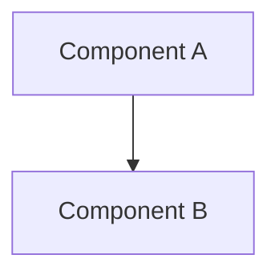
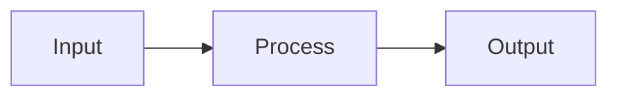

# Analyze execution patterns Architecture

## Epic
**As a** system architect
**I want** understand analyze execution patterns architecture
**So that** design and implement analyze execution patterns effectively

## Architecture Overview

### High-Level Design
The Advanced Genetic Expression Architecture provides sophisticated control mechanisms for genetic system operations, including dynamic execution flow control, cross-lobe communication, and multidimensional task navigation. This system enables complex genetic expressions with interruption points, alignment hooks, and advanced search algorithms.

### Component Diagram


### Data Flow


## Components

### MainComponent
**Purpose**: Main system component

**Key Interfaces**:
```python
def main_interface():
    pass
```

**Design Rationale**: Design rationale to be documented.

## Integration Points

### Input Dependencies
- External dependencies

### Output Dependencies  
- Output interfaces

### Cross-System Integration
- Integration points

## Performance Considerations

### Scalability
Scalability considerations

### Resource Usage
Resource usage patterns

### Optimization Strategies
Optimization strategies

## Related Documentation
[[architecture.md]] - System architecture
