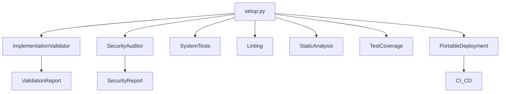

# QA, Security & Deployment Integration

## Overview

The MCP system implements a comprehensive quality assurance (QA), security, and deployment pipeline to ensure reliability, safety, and portability across all environments.

- **ImplementationValidator**: Validates code for stubs, method coverage, integration points, error handling, test coverage, and documentation.
- **SecurityAuditor**: Runs a full security audit (input validation, authentication, SQL injection, file/network ops, cryptography, dependencies, logging, error handling, AST-based static analysis).
- **setup.py**: Main setup script that builds the environment, installs dependencies, initializes databases, runs tests, linting, static analysis, coverage, and now the security audit.
- **Portable Deployment**: Scripts and documentation for creating and deploying portable, self-contained archives.
- **CI/CD Integration**: Example workflows for automated deployment, testing, and security checks.

## Architecture



## How It Works

- **Validation**: `ImplementationValidator` checks for stubs, coverage, integration, and documentation.
- **Testing**: Automated tests (pytest) and core tests are run during setup and deployment.
- **Security**: `SecurityAuditor` runs after tests, reporting issues, warnings, recommendations, and a security score.
- **Deployment**: `create_portable_archive.py` and `deploy_portable.py` create and deploy portable archives, running tests and setup automatically.
- **CI/CD**: Example GitHub Actions workflow runs deployment, tests, and security audit.

## Usage Example

```bash
# Run full setup with QA and security audit
python scripts/setup.py

# Create and deploy a portable archive
python deployment_packages/create_portable_archive.py --output my_mcp.zip
python deployment_packages/deploy_portable.py my_mcp.zip --target my_project

# Run security audit directly
python scripts/security_audit.py
```

## Cross-Links

- [[ImplementationValidator]]
- [[SecurityAuditor]]
- [[setup.py]]
- [[PORTABLE_ARCHIVE_README.md]]
- [[P2P_BENCHMARKING]]
- [[SIMULATION_LAYER]]
- [[ARCHITECTURE.md]]

## Extension Points

- Integrate additional static analysis or security tools into the setup pipeline.
- Expand test coverage and validation for experimental lobes and workflows.
- Automate periodic reporting and dynamic tagging for QA and security.
- Add Makefile or CLI targets for one-command QA/security/deployment checks.

---

For more details, see:
- [[ARCHITECTURE.md]]
- [[ImplementationValidator]]
- [[SecurityAuditor]]
- [[PORTABLE_ARCHIVE_README.md]] 