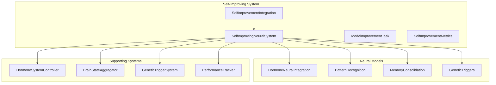

# Self-Improving Neural Network System

## Overview

The Self-Improving Neural Network System is a revolutionary component of the MCP (Model Context Protocol) that enables the system to optimize, improve, and pretrain its own neural networks through recursive self-improvement. This creates a feedback loop where improved neural networks can then be used to improve other neural networks, leading to continuous enhancement and evolution of the entire system.

## Key Features

### 🔄 **Recursive Self-Improvement**
- Neural networks use themselves to improve other neural networks
- Continuous feedback loop for perpetual optimization
- Self-supervised learning using system-generated data

### 🧠 **Brain-Inspired Architecture**
- Hormone-driven optimization strategies
- Genetic algorithm integration for architecture evolution
- Cross-model knowledge distillation and transfer

### 📊 **Performance-Based Optimization**
- Automatic performance comparison between implementations
- Dynamic switching between neural and algorithmic methods
- Real-time performance monitoring and improvement tracking

### 🎯 **Intelligent Task Prioritization**
- Hormone-influenced priority calculation
- Genetic trigger-based optimization targeting
- Resource-aware improvement scheduling

## Architecture

### Core Components



### Improvement Workflow

1. **Task Generation**: System analyzes current model performance and generates improvement tasks
2. **Priority Calculation**: Tasks are prioritized based on hormone levels and genetic triggers
3. **Execution**: Improvement tasks are executed using various strategies
4. **Evaluation**: Improved models are evaluated against performance metrics
5. **Integration**: Successful improvements are integrated into the system
6. **Feedback**: Hormone responses and genetic triggers are updated

## Implementation Details

### SelfImprovingNeuralSystem

The core class that manages the recursive self-improvement process.

```python
class SelfImprovingNeuralSystem:
    def __init__(self, hormone_integration, genetic_system, hormone_system, brain_state):
        # Initialize system components
        self.hormone_integration = hormone_integration
        self.genetic_system = genetic_system
        self.hormone_system = hormone_system
        self.brain_state = brain_state
        
        # Improvement tracking
        self.iteration = 0
        self.total_improvements = 0
        self.improvement_history = []
```

#### Key Methods

- `start_self_improvement_loop()`: Start continuous improvement process
- `run_improvement_cycle()`: Execute single improvement cycle
- `generate_improvement_tasks()`: Create tasks based on performance analysis
- `execute_improvement_task()`: Execute specific improvement task
- `save_improved_model()`: Save improved models with metadata

### Improvement Strategies

#### 1. Training Improvements
- **Purpose**: Improve model accuracy through better training
- **Trigger**: Low accuracy (< 0.75)
- **Method**: Enhanced training with system-generated data
- **Features**: Adaptive learning rates, early stopping, gradient clipping

#### 2. Optimization Improvements
- **Purpose**: Reduce latency and resource usage
- **Trigger**: High latency (> 200ms)
- **Method**: Model quantization, pruning, knowledge distillation
- **Features**: Dynamic optimization, resource-aware improvements

#### 3. Architecture Improvements
- **Purpose**: Enhance model architecture for better performance
- **Trigger**: Medium accuracy (0.75-0.85)
- **Method**: Genetic architecture search, layer optimization
- **Features**: Evolutionary design, automated architecture exploration

#### 4. Knowledge Distillation
- **Purpose**: Transfer knowledge from better models to weaker ones
- **Trigger**: High accuracy models available
- **Method**: Teacher-student learning, attention transfer
- **Features**: Cross-model learning, knowledge preservation

### Hormone-Driven Optimization

The system uses biologically-inspired hormone levels to influence optimization decisions:

```python
def _calculate_task_priority(self, model_id: str, performance: Dict[str, Any]) -> float:
    base_priority = 1.0
    
    # Hormone influence
    hormone_levels = self.hormone_system.get_hormone_levels()
    
    # High dopamine increases priority for reward-seeking improvements
    if hormone_levels.get('dopamine', 0.5) > 0.7:
        base_priority *= 1.5
    
    # High cortisol increases priority for stress-related improvements
    if hormone_levels.get('cortisol', 0.3) > 0.6:
        base_priority *= 1.3
    
    return base_priority
```

### Genetic Algorithm Integration

Genetic triggers influence optimization targeting:

```python
def _get_current_environment(self) -> Dict[str, Any]:
    environment = {
        'system_load': 0.5,
        'memory_usage': 0.3,
        'error_rate': 0.01,
        'task_complexity': 0.6,
        'user_interaction_level': 0.4
    }
    
    # Get active genetic triggers
    active_triggers = self.genetic_system.get_active_triggers(environment)
    
    return environment
```

## Usage Examples

### Basic Usage

```python
# Create self-improving system
system = SelfImprovingNeuralSystem(
    hormone_integration=hormone_integration,
    genetic_system=genetic_system,
    hormone_system=hormone_system,
    brain_state=brain_state
)

# Start self-improvement
await system.start_self_improvement_loop()

# Force improvement cycle
await system.force_improvement_cycle()

# Get status
status = await system.get_improvement_status()
```

### Integration with MCP

```python
# Create integration
integration = SelfImprovementIntegration(
    enhanced_mcp=enhanced_mcp,
    config=SelfImprovementConfig(
        enabled=True,
        auto_start=True,
        improvement_interval=300.0,
        hormone_driven=True,
        genetic_enhanced=True
    )
)

# Initialize
await integration.initialize()

# Add custom improvement task
await integration.add_custom_improvement_task(
    model_id='hormone_dopamine',
    improvement_type='training',
    priority=1.5
)

# Optimize specific model
await integration.optimize_specific_model('pattern_recognition', 'auto')
```

### Monitoring and Analysis

```python
# Get improvement status
status = await integration.get_improvement_status()

# Get improvement history
history = await integration.get_improvement_history(limit=50)

# Get model performance
performance = await integration.get_model_performance('hormone_dopamine')

# Generate health report
health_report = await integration.get_system_health_report()

# Export data for analysis
export_data = await integration.export_improvement_data()
```

## Performance Metrics

### Improvement Tracking

The system tracks comprehensive metrics for each improvement:

```python
@dataclass
class SelfImprovementMetrics:
    iteration: int
    models_improved: int
    total_improvement: float
    best_performance_gain: float
    average_training_time: float
    hormone_levels: Dict[str, float]
    genetic_activations: int
    memory_usage: float
    timestamp: datetime
```

### Health Metrics

System health is calculated based on multiple factors:

- **Overall Health**: Weighted combination of efficiency, stability, and learning rate
- **Improvement Efficiency**: Average performance gain per improvement
- **System Stability**: Consistency of improvement success rate
- **Learning Rate**: Rate of performance improvement over time

## Configuration

### SelfImprovementConfig

```python
@dataclass
class SelfImprovementConfig:
    enabled: bool = True
    auto_start: bool = True
    improvement_interval: float = 300.0  # 5 minutes
    max_concurrent_improvements: int = 3
    performance_threshold: float = 0.1  # 10% improvement required
    hormone_driven: bool = True
    genetic_enhanced: bool = True
    cross_model_distillation: bool = True
    model_backup_enabled: bool = True
    improvement_history_size: int = 1000
```

### System Configuration

```python
config = {
    'max_concurrent_tasks': 3,
    'improvement_interval': 300.0,
    'performance_threshold': 0.1,
    'max_iterations': 1000,
    'model_save_path': 'data/improved_models',
    'backup_models': True,
    'hormone_driven_optimization': True,
    'genetic_architecture_search': True,
    'cross_model_distillation': True
}
```

## Advanced Features

### Cross-Model Knowledge Distillation

The system can transfer knowledge between models:

```python
async def _perform_knowledge_distillation(self, teacher_model, student_model, task):
    # Transfer knowledge from teacher to student
    # Use soft targets, attention transfer, and feature mapping
    # Preserve knowledge while improving efficiency
```

### Genetic Architecture Evolution

Genetic algorithms optimize model architectures:

```python
async def _evolve_model_architecture(self, model_id: str, task: ModelImprovementTask):
    # Use genetic algorithm to evolve architecture
    # Optimize layer structure, activation functions, regularization
    # Balance performance and efficiency
```

### Self-Supervised Pretraining

Models are pretrained using system-generated data:

```python
async def _generate_training_data(self, model_id: str) -> List[Tuple]:
    # Generate training data using the system itself
    # Use algorithmic implementations as ground truth
    # Create diverse training scenarios
```

## Benefits

### 1. **Continuous Improvement**
- Models improve automatically over time
- No manual intervention required
- Perpetual optimization cycle

### 2. **Adaptive Optimization**
- System adapts to changing conditions
- Hormone-driven decision making
- Genetic algorithm evolution

### 3. **Resource Efficiency**
- Optimized model architectures
- Reduced computational requirements
- Intelligent resource allocation

### 4. **Knowledge Transfer**
- Cross-model learning
- Knowledge preservation
- Efficient information sharing

### 5. **Performance Monitoring**
- Real-time performance tracking
- Comprehensive metrics
- Health monitoring and reporting

## Future Enhancements

### Planned Features

1. **Multi-Objective Optimization**: Balance accuracy, latency, and resource usage
2. **Federated Learning**: Distributed improvement across multiple systems
3. **Quantum-Inspired Algorithms**: Quantum computing principles for optimization
4. **Advanced Neural Architectures**: Transformer, attention mechanisms
5. **Automated Hyperparameter Tuning**: Intelligent parameter optimization

### Research Directions

1. **Meta-Learning**: Learning to learn more efficiently
2. **Neural Architecture Search**: Automated architecture discovery
3. **Continual Learning**: Lifelong learning without forgetting
4. **Explainable AI**: Understanding improvement decisions
5. **Robustness**: Improving model reliability and safety

## Conclusion

The Self-Improving Neural Network System represents a significant advancement in autonomous AI systems. By enabling neural networks to improve themselves and each other, it creates a foundation for continuous evolution and optimization. The integration with brain-inspired architectures, hormone systems, and genetic algorithms provides a robust framework for intelligent self-improvement.

This system demonstrates the potential for AI systems to become truly self-improving, leading to more capable, efficient, and adaptive artificial intelligence systems.

## Related Documentation

- [Hormone System Controller](../hormone-system/Hormone-System-Controller.md)
- [Brain State Aggregator](../core-systems/Brain-State-Aggregator.md)
- [Genetic Trigger System](../genetic-system/Advanced-Genetic-Evolution.md)
- [Neural Network Models](../neural-network-models/README.md)
- [Performance Optimization](../performance-optimization/README.md) 