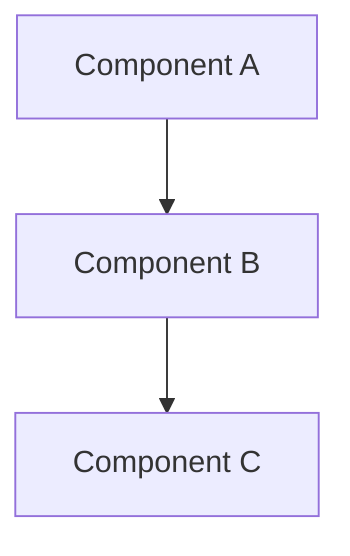

# Database Design Architecture

## Epic
**As a** system architect
**I want** to understand the architecture of database design
**So that** I can design effective solutions

## User Stories

### Story 1: Architecture Understanding
**As a** architect
**I want** to understand the database design architecture
**So that** I can make informed design decisions

**Acceptance Criteria:**
- [ ] Given I need to understand database design, When I read the architecture docs, Then I understand the design
- [ ] Given I understand the architecture, When I design solutions, Then they align with the system

## Architecture Overview

Architecture overview for database design will be documented here.

## Component Diagram


## Components

### Main Component
**Purpose**: Main functionality of database design

**Key Interfaces**:
```python
def main_interface():
    """
    Main interface for database design.
    """
    pass
```

## Related Documentation
- [[architecture.md]] - System architecture
- [[../core-systems/README|Core-Systems]] - Core system components
- [[Documentation-Index.md]] - Main documentation index
