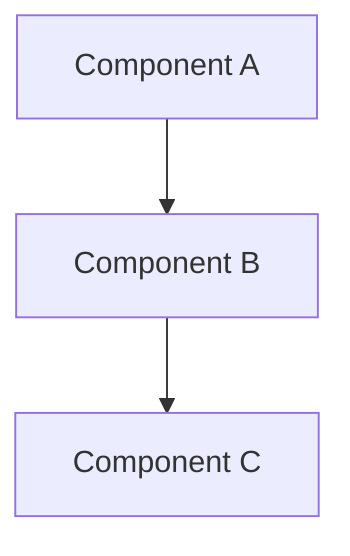

# Architecture Architecture

## Epic
**As a** system architect
**I want** to understand the architecture of architecture
**So that** I can design effective solutions

## User Stories

### Story 1: Architecture Understanding
**As a** architect
**I want** to understand the architecture architecture
**So that** I can make informed design decisions

**Acceptance Criteria:**
- [ ] Given I need to understand architecture, When I read the architecture docs, Then I understand the design
- [ ] Given I understand the architecture, When I design solutions, Then they align with the system

## Architecture Overview

Architecture overview for architecture will be documented here.

## Component Diagram


## Components

### Main Component
**Purpose**: Main functionality of architecture

**Key Interfaces**:
```python
def main_interface():
    """
    Main interface for architecture.
    """
    pass
```

## Related Documentation
- [[architecture.md]] - System architecture
- [[../core-systems/README|Core-Systems]] - Core system components
- [[Documentation-Index.md]] - Main documentation index
